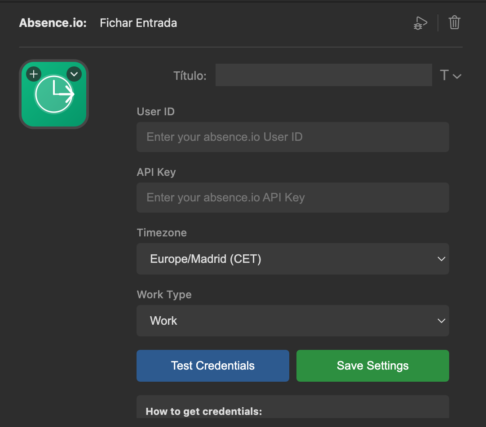

# Absence.io Plugin for StreamDeck

[](https://github.com/yourusername/absence-streamdeck-plugin)
[](LICENSE)

StreamDeck plugin to manage your absence.io time tracking directly from your StreamDeck device.



## ✨ Features

- **Clock In/Out** - Start and end your workday with a single button press
- **Pause/Resume** - Manage breaks during your work session
- **Status Check** - View current time tracking status and elapsed time
- **Test Connection** - Verify API credentials before use
- **Multi-language** - Full support for English and Spanish
- **Zero Dependencies** - Uses only native Node.js modules for maximum compatibility

## 🚀 Quick Start

1. **Install** the plugin from the [releases page](https://github.com/yourusername/absence-streamdeck-plugin/releases)
2. **Configure** your absence.io API credentials
3. **Start tracking** your time with StreamDeck buttons

For detailed installation instructions, see [Installation Guide](docs/INSTALLATION.md).

## 📋 Requirements

- **StreamDeck** 6.9 or higher
- **Node.js** 20+ (included with StreamDeck)
- **absence.io account** with API access

## 🔑 Getting API Credentials

1. Log in to [absence.io](https://app.absence.io)
2. Go to **Profile** → **Integrations**
3. Click **Generate API Key**
4. Copy the **Key Identifier** (User ID) and **API Key**
5. Paste them into the plugin configuration

**Important:** The API Key is only shown once. Save it securely.

## 📚 Documentation

- [Installation Guide](docs/INSTALLATION.md) - Detailed installation steps
- [User Guide](docs/USER_GUIDE.md) - How to use the plugin
- [Development Guide](docs/DEVELOPMENT.md) - Developer documentation
- [API Reference](docs/API.md) - absence.io API documentation
- [Contributing](docs/CONTRIBUTING.md) - How to contribute
- [Changelog](docs/CHANGELOG.md) - Version history

## 🎯 Available Actions

### Clock In
Start your work time tracking. Press once to begin tracking.

### Clock Out
End your work session. The button displays the total time worked.

### Pause
Temporarily pause time tracking. Use Clock In to resume.

### Status
Check your current tracking status and see elapsed time.

### Test Connection
Verify your API credentials are working correctly.

## 🛠️ Development

### Build from Source

```bash
# Clone the repository
git clone <your-repository>
cd absence_plugin

# Install dependencies (only for build tools)
npm install

# Build the plugin
npm run build

# Create symbolic link (macOS)
ln -s "$(pwd)/com.cajigas.absence.sdPlugin" "$HOME/Library/Application Support/com.elgato.StreamDeck/Plugins/"

# Restart StreamDeck
```

For detailed development instructions, see [Development Guide](docs/DEVELOPMENT.md).

### Project Structure

```
absence_plugin/
├── com.cajigas.absence.sdPlugin/  # Plugin directory
│   ├── manifest.json              # Plugin configuration
│   ├── index.html                 # Main plugin code
│   ├── propertyInspector.html     # Configuration UI
│   ├── i18n.js                    # Internationalization
│   ├── en.json                    # English translations
│   ├── es.json                    # Spanish translations
│   └── images/                    # Plugin icons
├── docs/                          # Documentation
├── build.js                       # Build script
├── package.json                   # Project configuration
└── README.md                      # This file
```

## 🌍 Internationalization

The plugin supports multiple languages:
- **English (en)** - Default
- **Spanish (es)**

The language is automatically detected from StreamDeck settings.

## 🔧 Technical Details

- **Architecture**: Standalone HTML/JavaScript plugin
- **Authentication**: Hawk Authentication (HMAC-SHA256)
- **Network**: Native fetch API with Web Crypto
- **WebSocket**: Direct connection to StreamDeck
- **No external dependencies**: 100% native browser APIs

## 🤝 Contributing

Contributions are welcome! Please read our [Contributing Guide](docs/CONTRIBUTING.md) before submitting a Pull Request.

## 📝 License

This project is licensed under the MIT License - see the [LICENSE](LICENSE) file for details.

## 🐛 Support

If you encounter any issues:

1. Check the [User Guide](docs/USER_GUIDE.md)
2. Review [Common Issues](docs/USER_GUIDE.md#troubleshooting)
3. Open an [issue](https://github.com/yourusername/absence-streamdeck-plugin/issues)

## 🙏 Acknowledgments

- [Elgato](https://www.elgato.com) for the StreamDeck SDK
- [absence.io](https://absence.io) for their time tracking API
- The StreamDeck developer community

---

**Made with ❤️ by [cajigas.es](https://cajigas.es)**
